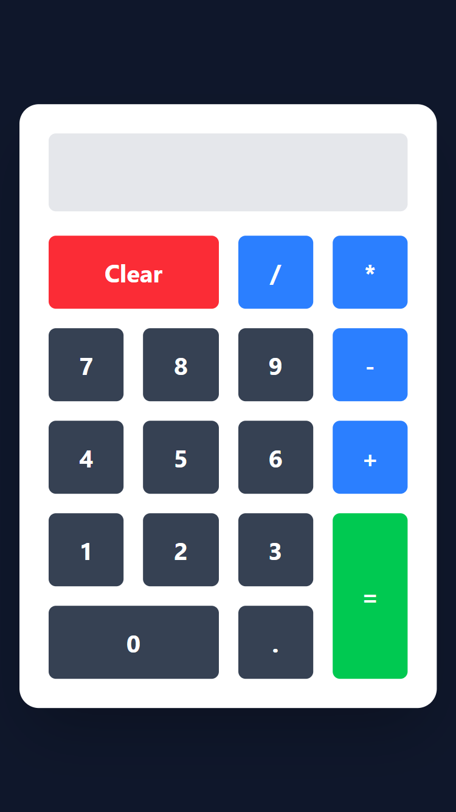

# React Calculator App

A clean and modern calculator web application built with **React** and styled using **Tailwind CSS**. It supports basic arithmetic operations and provides a responsive, user-friendly UI.

## 🚀 Features

- ✅ Perform basic arithmetic operations (`+`, `-`, `*`, `/`)
- ✅ Responsive grid layout
- ✅ Clean UI with gradient background
- ✅ Styled using Tailwind CSS
- ✅ Read-only input field
- ✅ Clear and equals functionality

## 🛠️ Built With

- [React](https://reactjs.org/) – JavaScript library for building user interfaces
- [Tailwind CSS](https://tailwindcss.com/) – Utility-first CSS framework

⚠️ **Note**:
This calculator uses eval() for simplicity, which is not recommended in production due to potential security issues. In a production-grade app, consider using a proper math parser like mathjs.

## Screenshots

- Small Screen
  
- Large Screen
  

## Demo Link

[Live Demo]()
